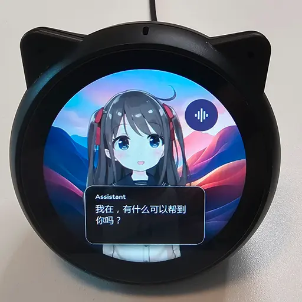

# NanoDash

A tiny smart display for your desk. NanoDash is an open-source Flutter app
(Linux/macOS/Windows) on your computer paired with an external ESP32 panel
over USB.

It mirrors a Flutter widget subtree to the panel's small round touchscreen and
feeds physical capacitive-touch events from the panel back into that same
subtree. The on-screen widget and the panel show the same UI.

  

## Modules

Pick the modules you want and swipe between them on the panel:

- **Clock & Weather** — a digital clock, plus current conditions with an hourly
  and multi-day forecast.
- **Calendar** — an upcoming-events agenda merged from your CalDAV/ICS feeds.
- **Timers & Stopwatch** — named countdowns (including Pomodoro) and a
  centisecond stopwatch.
- **System & Usage monitors** — live CPU, memory, and network telemetry, plus
  rolling rate-limit usage for the Claude Code and Codex CLIs.
- **Markets** — a live watchlist of stocks, indices, crypto, and FX.
- **Now Playing & Video** — mirror your computer's current media session, or
  play a local video file straight to the panel.
- **Live2D avatar** — an animated character rendered on the panel.

You can also talk to NanoDash: a built-in **voice assistant** runs speech
recognition and synthesis locally and answers through an on-screen avatar. Ask
it about the weather, your calendar, or the markets, or have it set reminders,
start timers, and switch the panel to any page — all by voice.

## Install

Download the latest release for your platform from the
[releases page](https://github.com/yplam/nano-dash/releases):

- **Windows** — [Microsoft Store](https://apps.microsoft.com/detail/9nmmbvr8gp0d).
- **macOS** — the `.dmg`.
- **Linux** — the Flatpak bundle.

You can run NanoDash on its own to preview the dashboard on screen; the external
panel is optional.

